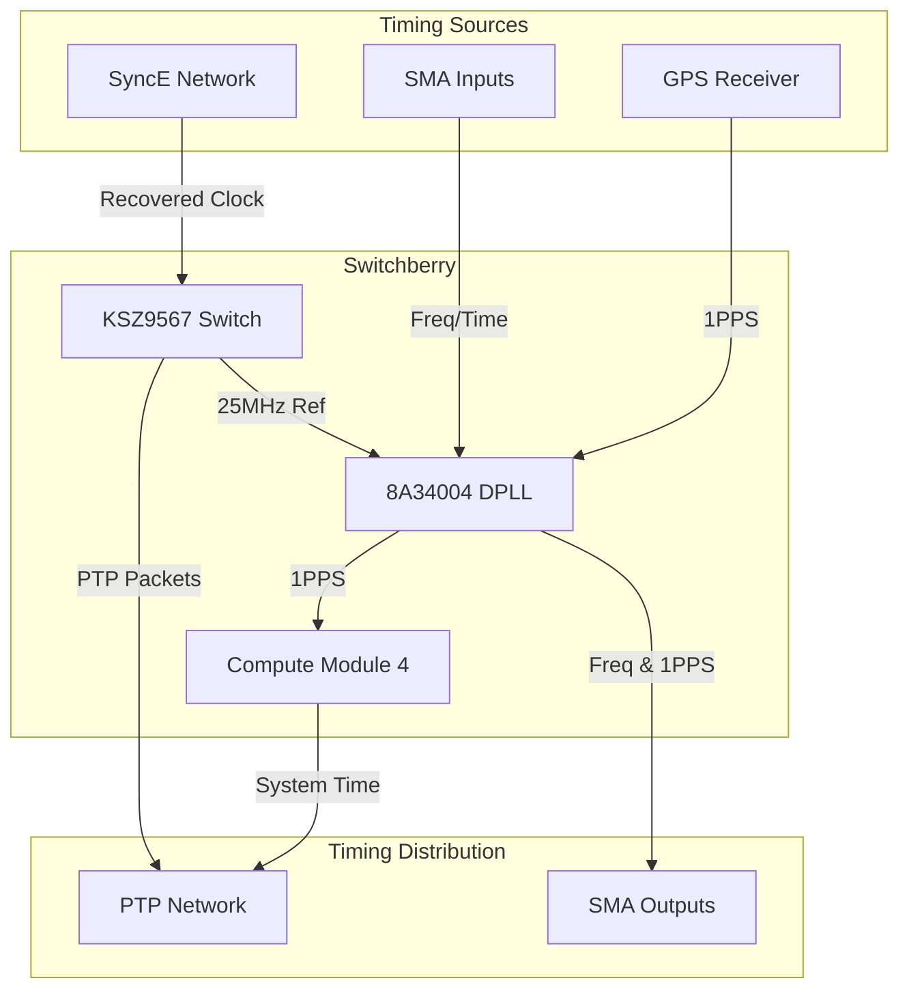

# Switchberry Timing Quick Start

This guide gets you from “fresh install” to a working timing/PTP setup, and shows how to customize behavior using the `config.py` wizard and the daemon Makefile.

### System Overview



---

## Default behavior (out of the box)

If you haven’t customized `/etc/startup-dpll.json`, the default setup is:

### PTP
- **Role:** **Grandmaster (GM)**
- **Mode:** **Unicast** (reduces message flooding; safer on shared networks)

### Input priorities
- **Time sources**
  1. **GPS** (highest priority for time)
  2. **SMA4** = 1PPS input (fallback time behind GPS)

- **Frequency sources**
  1. **SMA1** = 10MHz input (highest priority for frequency)

### Outputs
- **SMA3** = 1PPS output (or other frequency)
- **SMA2** = 10MHz output (**frequency-only**, V6 board - not phase-aligned)

> **V6 Board Note:** **SMA2** is routed via Channel 5 (SyncE frequency channel) and only
> provides frequency alignment, not phase alignment. For phase-aligned 1PPS output,
> use **SMA4** instead (which is routed via Channel 6).

### Advanced: Hardware SMA Mapping
For users debugging schematics or low-level GPIO code, here is the mapping between Rear-Panel labels (User) and Schematic labels (Hardware):

| User Label (Rear) | Hardware Label (Schematic) |
| :--- | :--- |
| **SMA1** | SMA4 |
| **SMA2** | SMA3 |
| **SMA3** | SMA2 |
| **SMA4** | SMA1 |

---

## Quick start: customize your timing/PTP setup

### 1) Clone the github software
```bash
cd ~/
git clone https://github.com/Time-Appliances-Project/Switchberry
cd Switchberry/Software 
chmod +x sb-*.sh
```

### 2) Run the config wizard
This script runs the wizard and automatically installs the generated configuration to `/etc/startup-dpll.json`.

```bash
./sb-config.sh
```

### 3) Apply changes and restart services
This script recompiles tools, installs services, and restarts the PTP stack.

```bash
sudo ./sb-reinstall.sh
```

### 4) Check Status
Monitor DPLL lock state, PTP synchronization, and service health.

```bash
./sb-status.sh
```

### 5) (Optional) Customize PTP configuration
If you need to change PTP profiles (e.g. Unicast vs Multicast), edit the config files managed by the services:
- Client: `~/Switchberry/Software/daemons/ptp4l-switchberry-client-uc.conf`
- Grandmaster: `~/Switchberry/Software/daemons/ptp4l-switchberry-gm-uc.conf`
Then run `sudo ./sb-reinstall.sh` to apply.


## Detailed setup 

This section is only if you want to start from a fresh SD card for instance. 

To access the Switchberry, you can use 

1. Micro-HDMI for monitor, USB-A for keyboard
2. Micro-USB on side. This will come up as UART to the CM4.
	To access this with a fresh SD card, you'll need to edit config.txt into the SD card to enable the UART.

In config.txt, add these at the end under [all]:

```bash
dtparam=spi=on
enable_uart=1
uart_2ndstage=1
dtoverlay=disable-bt
dtoverlay=switchberrytc
#dtoverlay=ksz9567
dtoverlay=spi0-1cs
dtoverlay=uart5,txd5_pin=12,rxd5_pin=13
dtoverlay=pcie-32bit-dma
dtparam=i2c_vc=off
hdmi_force_hotplug=1
```

### 1) Setup SD-card
Edit config.txt in bootfs of SD card like above. Enables UART and boot without monitor.

### 2) Clone the github software
```bash
cd ~/
git clone https://github.com/Time-Appliances-Project/Switchberry
cd Switchberry 
```

### 3) Install a bunch of dependencies

```bash
sudo apt update
sudo apt install bc bison flex libssl-dev make screen vim automake iperf tshark autoconf libmnl-dev libmnl-doc jq gpsd gpsd-clients socat linuxptp 
```

### 4) Clone kernel sources
Instructions for building CM4 kernel are here: https://www.raspberrypi.com/documentation/computers/linux_kernel.html

```bash 
cd ~/
mkdir kernel
cd kernel
git clone --depth=1 https://github.com/raspberrypi/linux
cd linux
# updated .config with additional items needed by switchberry like MDIO and others 
cp ~/Switchberry/Software/kernel/.config ./.config
# device tree overlays for switchberry, for both default ("Transparent clock") and DSA ("Boundary clock"), and Makefile
cp ~/Switchberry/Software/kernel/ksz9567-overlay.dts arch/arm/boot/dts/overlays/
cp ~/Switchberry/Software/kernel/switchberrytc-overlay.dts arch/arm/boot/dts/overlays/
cp ~/Switchberry/Software/kernel/copy_Makefile arch/arm/boot/dts/overlays/Makefile
```

### 5) Rebuild kernel with updated config and overlays

This step will take significant time!
```bash 
cd ~/kernel/linux
KERNEL=kernel8

# THIS STEP ESPECIALLY takes a long time , I run it in screen so if you disconnect it keeps going
#screen -S test # do this if you're familiar with screen so ssh connection can drop 
# if it asks questions, just hold enter for defaults
make -j6 Image.gz modules dtbs ; sudo make -j6 modules_install

KERNEL=kernel8
sudo cp /boot/firmware/$KERNEL.img /boot/firmware/$KERNEL-backup.img
sudo cp arch/arm64/boot/Image.gz /boot/firmware/$KERNEL.img
sudo cp arch/arm64/boot/dts/broadcom/*.dtb /boot/firmware/
sudo cp arch/arm64/boot/dts/overlays/*.dtb* /boot/firmware/overlays/
sudo cp arch/arm64/boot/dts/overlays/README /boot/firmware/overlays/
```

### 6) Reboot

```bash
sudo reboot
```

### 7) Install third party dependencies

#### spidev-test

```bash
cd ~/kernel/linux/tools/spi
make clean; make all; sudo make install
```

#### mdio-tools

```bash
cd ~/
git clone https://github.com/wkz/mdio-tools
cd mdio-tools/kernel
KDIR=~/kernel/linux/
make all; sudo make install 
cd .. 
./autogen.sh
./configure --prefix=/usr && make all && sudo make install
```

#### testptp

```bash
cd ~/kernel/linux/tools/testing/selftests/ptp
gcc -Wall -lrt testptp.c -o testptp
sudo cp testptp /usr/bin/
```


### 8) Build & Install everything for Switchberry

```bash
cd ~/Switchberry/Software/
chmod +x install_all.sh
sudo ./install_all.sh
```

### 9) Customize 

Follow quick-start guide above at this point, everything should be installed!

You need to create a /etc/startup-dpll.json for everything to get configured and operate properly.


