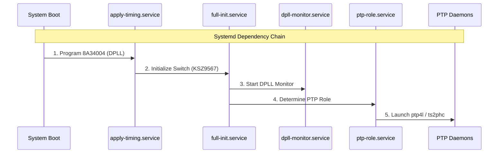

# Switchberry Daemons & Makefile Control

This directory contains the **systemd services** that bring up Switchberry’s timing + switch + PTP stack, plus a **Makefile** that installs and controls the whole set.

---

## Boot / runtime service chain

The system is intended to start in this order:



1. **Init DPLL + board multiplexers**
   - **Service:** `switchberry-apply-timing.service`
   - **Runs:** `/usr/local/sbin/apply_timing.py -c /etc/startup-dpll.json`
   - **What it does:** Programs the 8A34004 ClockMatrix runtime config and configures board muxes so PPS/clock signals are routed as intended.

2. **Init switch defaults (Transparent Clock enabled, SyncE output disabled by default)**
   - **Service:** `switchberry-full-init.service`
   - **Runs:** `/usr/local/sbin/full_init.sh`
   - **What it does:** Initializes the KSZ9567 into a known-good default state (typically TC mode with hardware forwarding). SyncE output is not enabled here by default.

3. **DPLL monitor / relock workaround**
   - **Service:** `switchberry-dpll-monitor.service`
   - **Runs:** `/usr/local/sbin/fastlock_1pps_fix.sh`
   - **What it does:** Monitors DPLL lock state and intervenes to force relock in edge cases (e.g. channels unlocking). This may coincide with brief relocks/phase jumps on PPS outputs.

4. **GNSS access plumbing (optional / image-dependent; “needs to be done” on some images)**
   - **Services:** `gpsd.service`, `gpspipe-socat.service`
   - **What it does:** Exposes GNSS/NMEA to other programs via gpsd and a simple relay.
   - **Note:** `gpsd.service` is often OS-provided and may not exist on every image.

5. **PTP role orchestration**
   - **Service:** `switchberry-ptp-role.service`
   - **Runs:** `/usr/local/sbin/switchberry-ptp-role.sh`
   - **What it does:** Starts the correct PTP daemons based on your configured role.

6. **Role-specific services started by `switchberry-ptp-role.sh`**
   - **Grandmaster (GM):**
     - `ts2phc-switchberry.service` — disciplines the CM4 Ethernet PHC from the timing chain
     - `ptp4l-switchberry-gm.service` — runs ptp4l as a GM
     - `switchberry-phc2sys.service` — syncs system clock from PHC (gated on ts2phc convergence)
     - `switchberry-chrony.service` — serves NTP using PHC refclock (gated on ts2phc convergence, GM+GPS only)
   - **Client:**
     - `ptp4l-switchberry-client.service` — runs ptp4l as a client (often unicast; user supplies GM IP in config)
	 - `switchberry-cm4-pps-monitor.service` — ensures PPS output from CM4 only when ptp4l is running and locked
     - `switchberry-phc2sys.service` — syncs system clock from PHC (gated on ptp4l lock quality)

7. **System clock and NTP features**
    - **phc2sys guard** (`switchberry_phc2sys_guard.sh`): Supervises `phc2sys` to copy PHC → `CLOCK_REALTIME`.
      In GM mode, gates on ts2phc status. In CLIENT mode, gates on ptp4l being locked (s2 + tight offsets).
      Stops phc2sys when upstream is lost, restarts when recovered.
    - **chrony guard** (`switchberry_chrony_guard.sh`): Supervises `chronyd` with a PHC refclock config.
      Only runs in GM+GPS mode. Gates on ts2phc convergence (PHC has GPS-accurate time).
      Stops chrony when GPS/DPLL is lost so stale time is never served.

---

## Key config

- **Timing config (used at boot):** `/etc/startup-dpll.json`  
  Consumed by `switchberry-apply-timing.service` via `apply_timing.py`.

---

## Makefile usage

This repo ships a `Makefile` that installs systemd units + helper scripts + config files, and provides convenient `systemctl`/`journalctl` wrappers to start/stop/check the Switchberry stack.

### Quick commands

```bash
# Show available targets
make

# Install everything, reload systemd, and enable default boot services
sudo make install

# Start/stop the full stack (in dependency-aware order)
make start
make stop

# Restart the full stack 
make restart

# Status + logs
make status
make logs S=switchberry-ptp-role.service

# Uninstall everything
sudo make uninstall 

```

---

## Testing NTP

When Switchberry is running as a **GM with GPS**, it serves NTP on the standard port (UDP 123).
To verify from another device on the same network:

### Linux
```bash
# One-shot query (shows offset, delay, stratum)
ntpdate -q <switchberry-ip>

# If ntpdate is not installed:
sudo apt install ntpdate
```

### macOS
```bash
# Built-in sntp utility
sntp <switchberry-ip>
```

### Windows (PowerShell)
```powershell
# Built-in w32tm utility
w32tm /stripchart /computer:<switchberry-ip> /samples:3
```

### Expected output
- **Stratum 1** — direct GPS/PHC hardware reference
- **Offset** near zero (a few milliseconds is normal over Ethernet)

> **Note:** `chrony` must be installed on the Switchberry image (`sudo apt install chrony`).
> The stock `chronyd.service` is automatically disabled by `sb-reinstall.sh` to avoid port conflicts.
